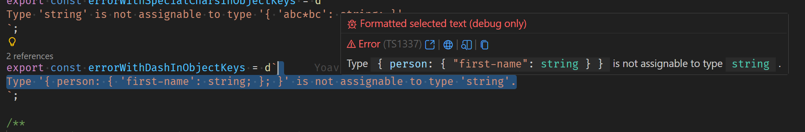

# Contributing to Pretty TypeScript Errors

First off, thanks for taking the time to contribute!

All types of contributions are encouraged and valued. See the [Table of Contents](#table-of-contents) for different ways to help and details about how this project handles them. Please make sure to read the relevant section before making your contribution. It will make it a lot easier for us maintainers and smooth out the experience for all involved. The community looks forward to your contributions.

And if you like the project, but just don't have time to contribute, that's fine. There are other easy ways to support the project and show your appreciation, which we would also be very happy about:

- Vote on the [open issues](https://github.com/yoavbls/pretty-ts-errors/discussions/43) at `microsoft/vscode` to allow for new and better features
- Star the project
- Share it on social media
- Mention the project at local meetups and tell your friends/colleagues
- Check the [`help wanted`](https://github.com/yoavbls/pretty-ts-errors/issues?q=state%3Aopen%20label%3A%22help%20wanted%22) label to see if you can help out

## Table of contents

- [I Have a Question](#i-have-a-question)
- [Reporting Bugs](#reporting-bugs)
- [Requesting Enhancements & Features](#enhancements-and-features)
- [Set up Local Dev Environment](#set-up-local-dev-environment)
- [Contributing to the Source Code](#contributing-to-the-source-code)
- [Attribution](#attribution)

## I Have a Question

Search in the [issues](https://github.com/yoavbls/pretty-ts-errors/issues) and [discussions](https://github.com/yoavbls/pretty-ts-errors/discussions) before you create a new one. If your question is not answered feel free to create a [new discussion](https://github.com/yoavbls/pretty-ts-errors/discussions/new/choose). If it concerns a bug consider writing [a bug report](https://github.com/yoavbls/pretty-ts-errors/issues/new?template=bug_report.md).

## Reporting Bugs

Search the [open issues](https://github.com/yoavbls/pretty-ts-errors/issues) before adding your own bug report. If none exists create a [new isse](https://github.com/yoavbls/pretty-ts-errors/issues/new?template=bug_report.md) by using the `Bug Report` template.

Try and add enough information to allow others to reproduce the error, if possible provide code samples or a link to a repository. If a bug cannot be reproduced, it will decrease the odds of it being fixed.

If the bug contains visual elements (like the hover feature), also provide a screenshot to help understand what goes wrong.

## Requesting Enhancements & Features

Search in the [issues](https://github.com/yoavbls/pretty-ts-errors/issues) and [discussions](https://github.com/yoavbls/pretty-ts-errors/discussions) and feel free to add your own comments to existing requests.

If none exists create a [new discussion](https://github.com/yoavbls/pretty-ts-errors/discussions/new/choose) to dicuss the requested feature or enhancement.

3 of the most requested enhancements and features are grouped in tracking issues:

- [Tracking: Performance Issues](https://github.com/yoavbls/pretty-ts-errors/issues/139)
- [Tracking: Internationalization and localization](https://github.com/yoavbls/pretty-ts-errors/issues/144)
- [Tracking: IDE support / LSP implementation](https://github.com/yoavbls/pretty-ts-errors/issues/145)

## Set up Local Dev Environment

To setup your local environment clone the project and run `npm i` to install all dependencies like:

```bash
git clone https://github.com/yoavbls/pretty-ts-errors.git
cd pretty-ts-errors
npm i
```

### Mono Repo & Turbo

`pretty-ts-errors` uses a mono-repo setup to manage the different packages under a single git repository. To run parallel tasks in all packages [`turbo`](https://turborepo.dev/) is used.

See the root `package.json` for the tasks that can be run. Check the package specific `package.json` to see what tasks can be run for that package.

When developing it is the easiest to run the `dev` command in the root of the package:

```bash
npm run dev
```

### Issues with Local Dev Setup

If you have issues with setting up your local dev environment, feel free to create a [new discussion](https://github.com/yoavbls/pretty-ts-errors/discussions/new/choose) to ask for help.

## Contributing to the Source Code

If you are looking to contribute to the source code check the [issues](https://github.com/yoavbls/pretty-ts-errors/issues) for what to work on. The label [`good first issue`](https://github.com/yoavbls/pretty-ts-errors/issues?q=state:open%20label:%22good%20first%20issue%22) is a good place to start, and consider checking the [`help wanted`](https://github.com/yoavbls/pretty-ts-errors/issues?q=state%3Aopen%20label%3A%22help%20wanted%22) to see if you can contribute. You can also tinker with the code, but it is preferred to have an existing issue to link to before you open a PR.

Keep in mind that there is a [Stability & Performance](https://code.visualstudio.com/api/advanced-topics/extension-host#stability-and-performance) impact when running extensions in VS Code, always keep in mind that the extension (code) should contribute to a users workflow, not diminish it.

### Architecture

See the [`ARCHITECTURE.md`](./docs/ARCHITECTURE.md) for more information about the project architecture.

### Styleguide

There is no specific styleguide to adhere to, besides the `eslint` and `prettier` commands that will lint and format the project. Try to keep the style similar to what already exists to keep the source code easier to read and maintain. Fundamental changes can always be discussed in PR's.

### Debugging & Testing

See the [`.vscode/launch.json`](.vscode/launch.json) for the available debug configurations. You can use the [VS Code debugger](https://code.visualstudio.com/docs/debugtest/debugging) (default `F5` key) to start a debugging sessions. It is recommended to use `Run Extension (all extensions disabled)` to improve startup time when iterating, use the `Run Extension` if you want to debug the extension with all you installed extensions enabled.

When running either of these debug tasks the `watch` task of the `apps/vscode-extension` directory will be run in the background, no additional actions are required to debug the extension.

There is a scaffolding setup for automated tests for the VS Code extension, but it is unused yet.

The [`@pretty-ts-errors/formatter`](./packages/formatter/) does have some unit tests which uses [`vitest`](https://vitest.dev/) as a testing framework.

When running the extension with the debugger there is a [`selectedTextHoverProvider`](./apps/vscode-extension/src/provider/selectedTextHoverProvider.ts) that allows for selecting text in the `test` directories and treat them as a typescript error message:


### Documentation & Resources

The documentation regarding `pretty-ts-errors` is found in the [`README.md`](./README.md), `CONTRIBUTING.md` or the [`docs`](./docs) directory.

Some comments in the code can be found where specific behaviour or caveats are documented, like the caching mechanism or performance critical sections.

The [Visual Studio Code Extension API documentation](https://code.visualstudio.com/api) is a good place to read about the extension API.
When external libraries are used, always check and read their respective documentation to ensure you are properly using them.

## Attribution

This guide is based on the [`contributing.md`](https://contributing.md/example/). [Make your own](https://contributing.md/)!
