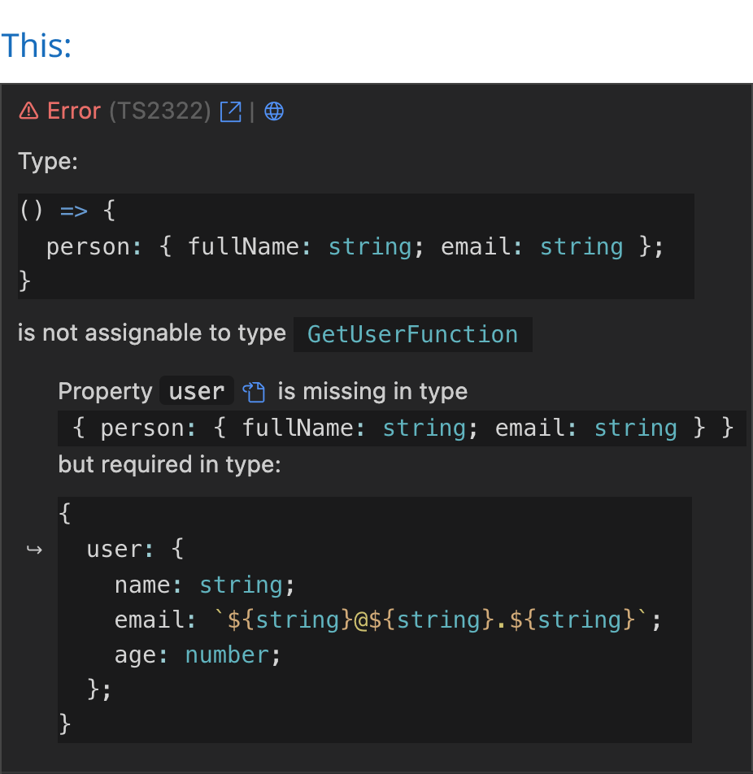
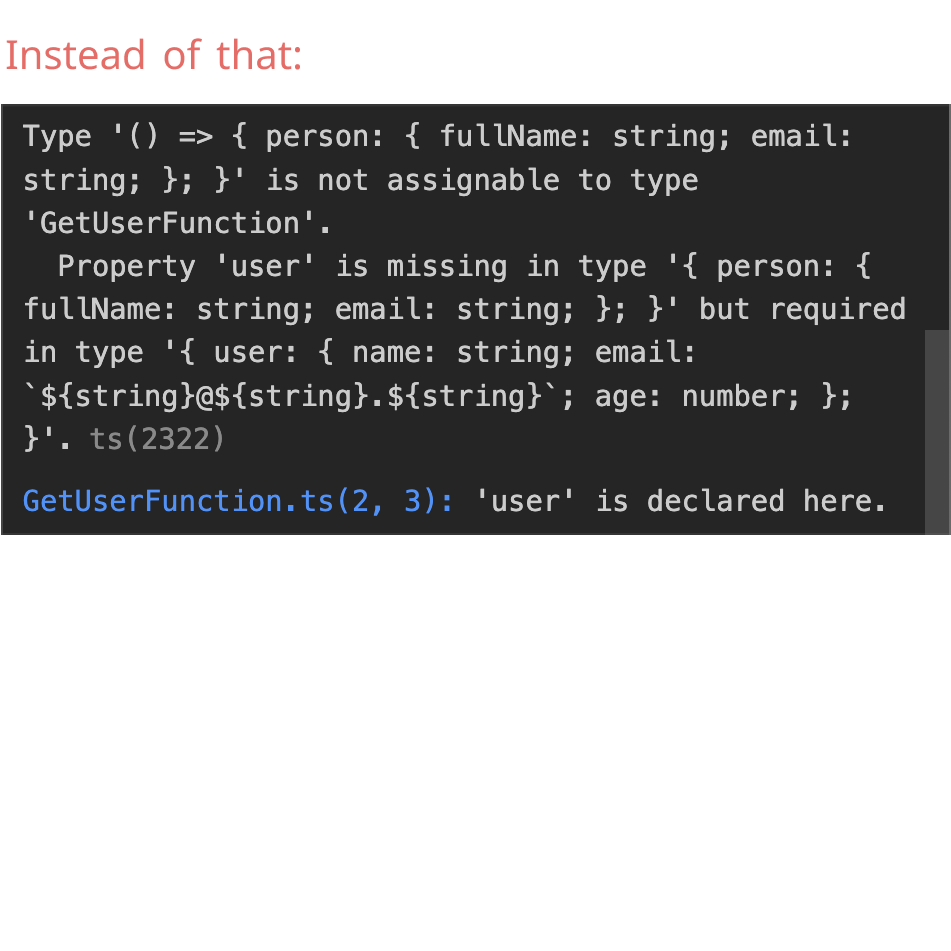
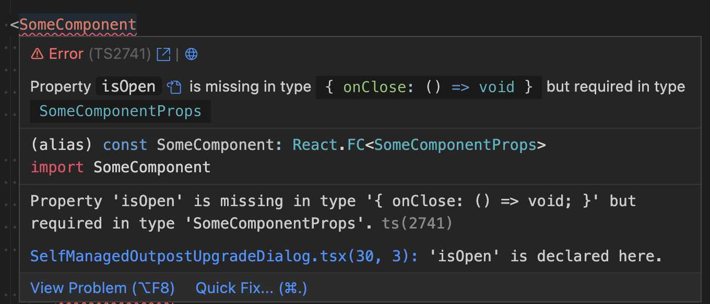

<a href="https://marketplace.visualstudio.com/items?itemName=yoavbls.pretty-ts-errors" style="display: none;">
  <picture>
    <source media="(prefers-color-scheme: dark)" srcset="https://raw.githubusercontent.com/yoavbls/pretty-ts-errors/main/assets/icon.png" width="140">
    <source media="(prefers-color-scheme: light)" srcset="https://raw.githubusercontent.com/yoavbls/pretty-ts-errors/main/assets/icon.png" width="140">
    
  </picture>
</a>

# Pretty `TypeScript` Errors

<b>Make TypeScript errors prettier and human-readable in VSCode.</b>  
  
[](https://GitHub.com/yoavbls/pretty-ts-errors/stargazers/)
[](https://marketplace.visualstudio.com/items?itemName=yoavbls.pretty-ts-errors)&nbsp;[](https://github.com/yoavbls/pretty-ts-errors/blob/main/LICENSE)&nbsp;[](https://marketplace.visualstudio.com/items?itemName=yoavbls.pretty-ts-errors)
<a href="https://github.com/yoavbls/pretty-ts-errors/discussions/43#user-content-jetbrains-support"></a>

TypeScript errors become messier as the complexity of types increases. At some point, TypeScript will throw on you a shitty heap of parentheses and `"..."`.  
This extension will help you understand what's going on. For example, in this relatively simple error:

&nbsp; &nbsp;   
  
  
## Watch this
<a href="https://www.youtube.com/watch?v=9RM2aErJs-s" target="_blank">
 
</a>

and others from: 
[Web Dev Simplified](https://www.youtube.com/watch?v=ccg-erZYO4k&list=PL0rc4JAdEsVpOriHzlAG7KUnhKIK9c7OR&index=1),
[Josh tried coding](https://www.youtube.com/watch?v=_9y29Cyo9uU&list=PL0rc4JAdEsVpOriHzlAG7KUnhKIK9c7OR&index=3),
[trash dev](https://www.youtube.com/watch?v=WJeD3DKlWT4&list=PL0rc4JAdEsVpOriHzlAG7KUnhKIK9c7OR&index=4&t=208),
and [more](https://www.youtube.com/playlist?list=PL0rc4JAdEsVpOriHzlAG7KUnhKIK9c7OR)


## Features
- Syntax highlighting with your theme colors for types in error messages, supporting both light and dark themes
- A button that leads you to the relevant type declaration next to the type in the error message
- A button that navigates you to the error at [typescript.tv](http://typescript.tv), where you can find a detailed explanation, sometimes with a video
- A button that navigates you to [ts-error-translator](https://ts-error-translator.vercel.app/), where you can read the error in plain English

## Supports
- Node and Deno TypeScript error reporters (in `.ts` files)
- JSDoc type errors (in `.js` and `.jsx` files)
- React, Solid and Qwik errors (in `.tsx` and `.mdx` files)
- Astro, Svelte and Vue files when TypeScript is enabled (in `.astro`, `.svelte` and `.vue` files)
- Ember and Glimmer TypeScript errors and template issues reported by Glint (in `.hbs`, `.gjs`, and `.gts` files)
  
  
## Installation
```
code --install-extension yoavbls.pretty-ts-errors
```
Or simply by searching for `pretty-ts-errors` in the [VSCode marketplace](https://marketplace.visualstudio.com/items?itemName=yoavbls.pretty-ts-errors)  
  
  
## Why isn't it trivial
1. TypeScript errors contain types that are not valid in TypeScript.  
Yes, these types include things like `... more ...`, `{ ... }`, etc in an inconsistent manner. Some are also cutting in the middle because they're too long.
2. Types can't be syntax highlighted in code blocks because the part of `type X = ...` is missing, so I needed to create a new TextMate grammar, a superset of TypeScript grammar called `type`.
3. VSCode markdown blocks all styling options, so I had to find hacks to style the error messages. e.g., there isn't an inlined code block on VSCode markdown, so I used a code block inside a codicon icon, which is the only thing that can be inlined. That's why it can't be copied. but it isn't a problem because you can still hover on the error and copy things from the original error pane.  
 

## Hype section
<a href="https://www.youtube.com/live/Zze1y2iZ3bQ?si=Yj1Qw2S8FbGbTA5c&t=11589">
  <picture>
    
  </picture>
</a>
<a href="https://twitter.com/tannerlinsley/status/1647982562026090496">
  <picture>
    <source media="(prefers-color-scheme: dark)" srcset="https://raw.githubusercontent.com/yoavbls/pretty-ts-errors/assets/assets/mentions/tanner-dark.png#gh-light-mode-only">
     <source media="(prefers-color-scheme: light)" srcset="https://raw.githubusercontent.com/yoavbls/pretty-ts-errors/assets/assets/mentions/tanner-light.png#gh-light-mode-only">
    
  </picture>
</a>
<a href="https://twitter.com/t3dotgg/status/1647759462709747713">
  <picture>    
    <source media="(prefers-color-scheme: dark)" srcset="https://raw.githubusercontent.com/yoavbls/pretty-ts-errors/assets/assets/mentions/theo-dark.png#gh-dark-mode-only">
    <source media="(prefers-color-scheme: light)" srcset="https://raw.githubusercontent.com/yoavbls/pretty-ts-errors/assets/assets/mentions/theo-light.png#gh-light-mode-only">
    
  </picture>
</a>
<a href="https://twitter.com/johnsoncodehk/status/1646214711204286465">
  <picture>
    <source media="(prefers-color-scheme: dark)" srcset="https://raw.githubusercontent.com/yoavbls/pretty-ts-errors/assets/assets/mentions/johnson-dark.png#gh-dark-mode-only">
    <source media="(prefers-color-scheme: light)" srcset="https://raw.githubusercontent.com/yoavbls/pretty-ts-errors/assets/assets/mentions/johnson-light.png#gh-light-mode-only">
    
  </picture>
</a>

  
### Stars from stars  
<table>
  <tbody>
    <tr>
      <td align="center">
        <a href="https://github.com/kentcdodds">
          <br>
          Kent C. Dodds  
        <a/>
      </td>
      <td align="center">
        <a href="https://github.com/mattpocock">
          <br>
          Matt Pocock  
        <a/>
      </td>
      <td align="center">
        <a href="https://github.com/katt">
          <br>
          Alex / KATT
        <a/>
      </td>
      <td align="center">
        <a href="https://github.com/tannerlinsley">
          <br>
          Tanner Linsley  
        <a/>
      </td>
      <td align="center">
        <a href="https://github.com/t3dotgg">
          <br>
          Theo Browne
        <a/>
      </td>
    </tr>
  </tbody>
</table>

  
## Sponsorship
Every penny will be invested in other contributors to the project, especially ones that work  
on things that I can't be doing myself like adding support to the extension for other IDEs 🫂
  
## Contribution
Help by upvoting or commenting on issues we need to be resolved [here](https://github.com/yoavbls/pretty-ts-errors/discussions/43)  
Any other contribution is welcome. Feel free to open any issue / PR you think.
  
  
  
