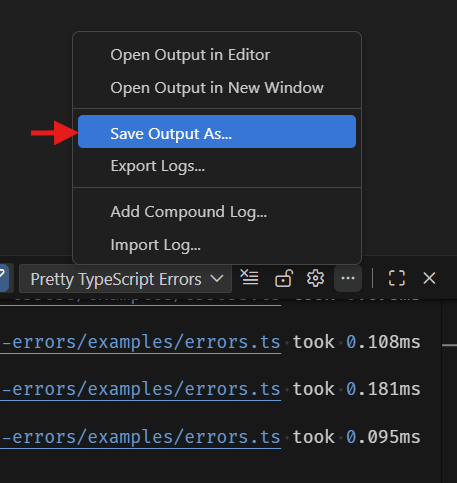

# Instructions to find and export the VS Code logs for Pretty TypeScript Errors

1. Open the output window to the `Pretty TypeScript Errors` channel
   
2. Set the log level of the `Pretty TypeScript Errors` output channel to `Trace`
   
3. **Reproduce your bug or error**, this should generate verbose logging output.
4. Either copy the output by selecting it or use one of the options in the menu shown:
   
5. Either paste the output or add the logfile to the GitHub issue
   
