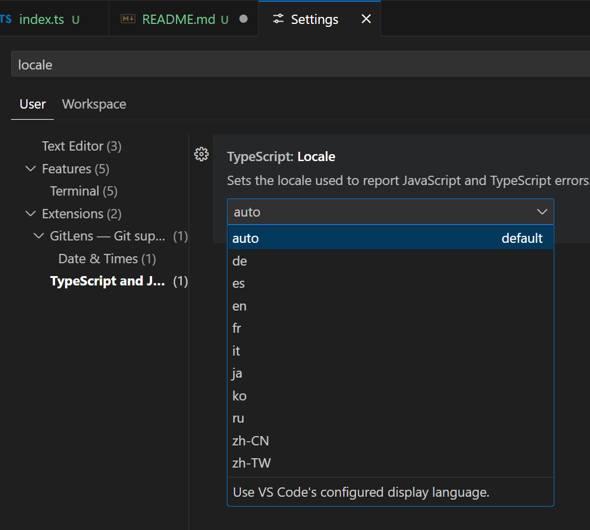

# `@pretty-ts-errors/diagnostics-l10n`

## Summary

A tool to generate & distribute lookup tables for diagnostic messages to locales that are supported by the TypeScript compiler.

## Why is it needed?

One of the requested features of _Pretty TypeScript Errors_ is [support of localization](#144).

The TypeScript compiler supports a flag in the host environment called `--locale`. In the CLI most people have probably never used it, but in editors the TypeScript Language Server can query the editor to ask which locale the user prefers, usually the locale of the editor.

VS Code supports the use of different display languages through [language packs](https://code.visualstudio.com/docs/configure/locales). For the TypeScript Language Features an option exists which defaults to `auto`, which is most likely based on the configured display language of VS Code:


For Pretty TypeScript Errors currently uses regex magic to parse the diagnostics into parts to know how to format the different parts correctly. When the messages are in a different language everything these regexes stop working.
The extension needs a way to parse the diagnostic messages language agnostic, to support all the different locales. Preferably one that does not require manually mapping out every single error message in every locale.

## How does the TypeScript Compiler manage this?

TypeScript itself uses several files to manage its locales.

These files are:

- [`scripts/generateLocalizedDiagnosticMessages.mjs`](https://github.com/microsoft/TypeScript/blob/v5.9.3/scripts/generateLocalizedDiagnosticMessages.mjs)
- [`scripts/processDiagnosticMessages.mjs`](https://github.com/microsoft/TypeScript/blob/v5.9.3/scripts/processDiagnosticMessages.mjs)
- [`src/compiler/diagnosticMessages.json`](https://github.com/microsoft/TypeScript/blob/v5.9.3/src/compiler/diagnosticMessages.json)
- [`src/loc/lcl/<language-code>/diagnosticMessages/diagnosticMessages.generated.json.lcl`](https://github.com/microsoft/TypeScript/tree/v5.9.3/lib)
- [`lib/<locale>/diagnosticMessages.generated.json`](https://github.com/microsoft/TypeScript/tree/v5.9.3/lib)

These internal tools and files [are used](https://github.com/microsoft/TypeScript/blob/v5.9.3/src/compiler/utilitiesPublic.ts#L685-L758) to swap the diagnostic messages to whatever locale is active at that time.

## API

What the API should look like and what it should do is still under discussion.
The current proposal is to provide an API like:

```ts
// `@pretty-ts-errors/diagnostics-l10n` provides either an export or function to fetch this data structure
declare const diagnosticMessageLocalesMap: DiagnosticMessageLocalesMap;

// using the spanish locale
const spanishLocale = "es";
const errorCode = 2322;
const diagnosticMessageTemplateInSpanish =
  diagnosticMessageLocalesMap[spanishLocale][errorCode];
// -> El tipo '{0}' no se puede asignar al tipo '{1}'.

// with the english locale (also the default locale of the TypeScript compiler)
const englishLocale = "en";
const diagnosticMessageTemplateInEnglish =
  diagnosticMessageLocalesMap[englishLocale][errorCode];
// -> Type '{0}' is not assignable to type '{1}'
```

The types are explained in [`src/index.ts`](./src/index.ts)

This should allow the extension to:

- receive the diagnostics
- split them into parts based on the matching template (fetched based on locale)
- format the parts into markdown
- stitch the result back together
- display it to the user

### What is implemented?

The script [`scripts/create-diagnostics-maps.js`](./scripts/create-diagnostics-maps.js):

- fetches `diagnosticMessages.json` from the typescript source at github (with a version tag, to try keep the URL and result stable).
- fetches the `<locale>/diagnosticMessages.generated.json` for each locale from the installed typescript version (these files reside in node_modules)
- merges the files to a `DiagnosticMessageLocalesMap` as in the example above
- writes out the map to `src/diagnosticMessagesMap.json`
- writes out a map to `src/diagnosticMessagesMap.<locale>.json` for each locale

### Remaining questions

- String encoding and multibyte characters are a thing. Some of the other locale's use non-ASCII characters in the diagnostics. How does the implementation handle this? Does it need to?
- RTL languages exist, are any of them in the locales TypeScript supports? If so, do we need special handling?
- How stable are the error codes? According to [this reply](https://github.com/microsoft/TypeScript-Website/issues/298#issuecomment-592252428) from the TypeScript team in 2020 the error codes are unstable.
